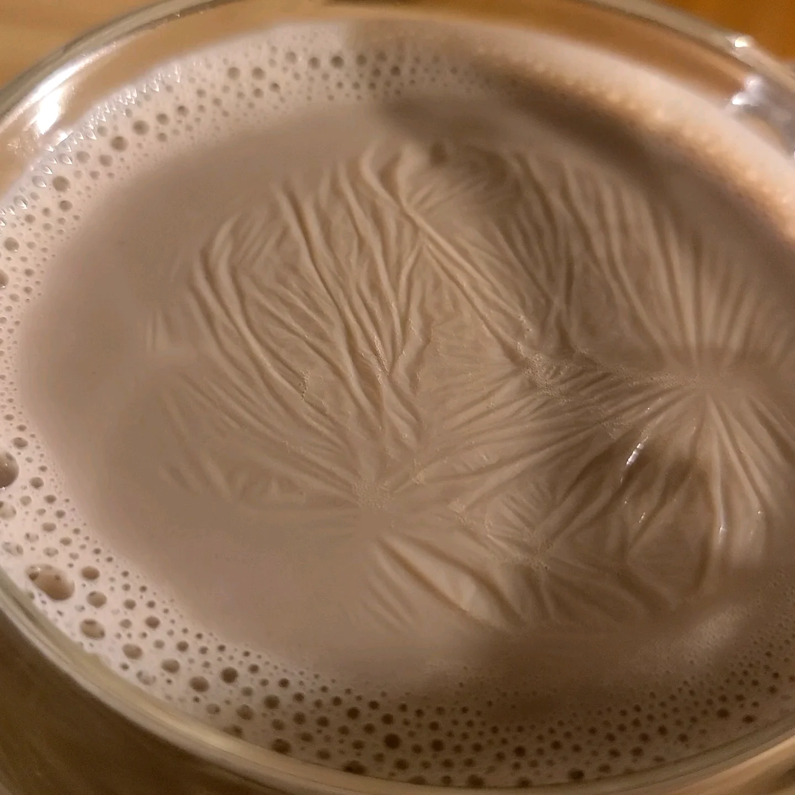

# Curvature-Propelled-thin-film
Have you wondered why the foam that spreads over the surface of your freshly poured beer gradually dissipates with remaining bubbles adhering to the edge of the mug? Both of these events might look disparate but if we look closely, water striders and the long-lasting bubbles in foam are both leveraging the surface tensions on liquids to get to their preferred position. They are able to achieve that through a subtle dance in balancing the surface tension of the liquid with the body weight of these objects. 

But what if we added another layer of freedom to this problem? Unlike bubbles that don't freely bend with interface, lets consider a film that can bend freely like denatured milk protein called "milk skin". 

What if we take a milk skin and place it on a liquid surface with a different curvature?
Based on my simulations, I can conclude that the film will prefer to be at the matching curvature and propel itself towards the matching curvature while relieving its wrinkles. Moreover, the simulations predict the system energy for both stretchable and inextensible films. 
While this project is being written up can be found in dissertation and under preparation for an upcoming paper, here I will focus on the data mining and automation involved in this project.

This project describes the methods employed to extract and clean the data obtained from my model on floating thin film project.

